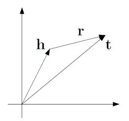
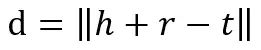
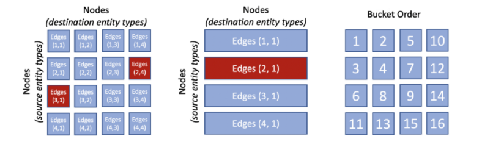
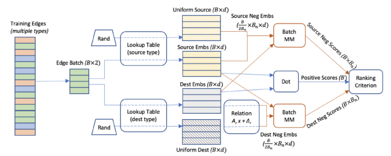

图（graph）是机器学习应用中最基本的数据结构之一，知识图谱本质也就是一个图，知识图谱通常是用一个三元组（实体h，关系r，实体t）来表示一条知识，比如：（天津大学，地点，天津），要使用向量表示的话，可以使用one-hot向量来表示。但是问题是one-hot向量表示知识话，会因为知识图谱中的实体和关系数目过多而导致向量的维数太高和表示知识向量的高度稀疏性，而且无法表示相近的实体或关系之间的相似程度。所以类比文本词向量的表示方法，例如word2vec、node2vec模型思想，使用分布式表示（distributed representation）来表示知识图谱中的实体和关系，通过学习获得它们的低维稠密表示。这种通过学习实体和关系获得它们的低维稠密向量被称为图嵌入。具体来说，图嵌入方法是一种无监督学习方法，可使用本地图结构来学习节点的表征。社交媒体预测、物联网模式检测或药物序列建模等主流场景中的训练数据可以很自然地表征为图结构。其中每一种场景都可以轻松得到具有数十亿相连节点的图。图结构非常丰富且具有与生俱来的导向能力，因此非常适合机器学习模型。尽管如此，图结构却非常复杂，难以进行大规模扩展应用。也因此，现代深度学习框架对大规模图数据结构的支持仍非常有限。Facebook 推出过一个框架 PyTorch BigGraph：https://github.com/facebookresearch/PyTorch-BigGraph，它能更快更轻松地为 PyTorch 模型中的超大图结构生成图嵌入。

某种程度上讲，图结构可视为有标注训练数据集的一种替代，因为节点之间的连接可用于推理特定的关系。这种方法遵照无监督图嵌入方法的模式，它可以学习图中每个节点的向量表征，其具体做法是优化节点对的嵌入，使得之间有边相连的节点对的嵌入比无边相连的节点对的嵌入更近。这类似于在文本上训练的 word2vec 的词嵌入的工作方式。当应用于大型图结构时，大多数图嵌入方法的结果都相当局限。举个例子，如果一个模型有 20 亿个节点，每个节点有 100 个嵌入参数（用浮点数表示），则光是存储这些参数就需要 800 GB 内存，因此很多标准方法都超过了典型商用服务器的内存容量。这是深度学习模型面临的一大挑战，也是 Facebook 开发 BigGraph 框架的原因。

训练的目标是生成代表我们知识的嵌入表示。一旦我们有了节点的嵌入，就应该很容易通过特定的关系类型确定相应的节点是否在我们的知识图谱中有连接（或应该连接）。不同的模型提出了比较嵌入矢量的不同方法。最简单的模型使用余弦或矢量乘积距离比较嵌入矢量。更复杂的模型在比较之前对矢量的元素应用不同的加权方案。加权方案表示为矩阵，具体到特定的关系类型。这里为模型训练速度和硬件的要求而使用简单而有效的TransE知识表示模型，该模型通过将关系表示为在embedding空间中的平移来建模。也就是把头实体和尾实体都表示成向量，然后用“头实体+关系=尾实体”去优化损失。

TransE模型的基本想法是前件的向量表示h与关系的向量表示r之和与后件的向量表示t越接近越好，即h+r≈t。这里的“接近”可以使用L1或L2范数进行衡量。





要优化的目标函数使用带negative sampling的max margin损失函数，即L(y,y’)=max(0,margin−y+y’)，其中y表示正样本的得分，y’表示负样本的得分。最小化这个损失函数可以使正样本的得分越来越高而负样本的得分越来越低，但是两个得分差距大到一定程度（margin）就足够了，再大的话得到的loss也只是0。在这里因为正负样本得分用的是距离，所以要加负号，即最终的损失函数为


其中





为L1或者L2范数。论文中获得负样本并不是随机选取其他的三元组，其中还有一个trick，将正样本三元组中的前件或后件替换为一个随机的实体已获取负样本。这样我就找到一种方法来测量边之间的**相似性得分**，并使用此分数来估计这些节点连接的可能性。

PyTorch BigGraph（PBG）的目标是扩展图嵌入模型，使其有能力处理包含数十亿节点和数万亿边的图。PBG 为什么有能力做到这一点？因为它使用了四大基本构建模块：

1. 图分区，这让模型不必完全载入到内存中。
2. 在每台机器上的多线程计算
3. 分批负采样，当每条边 100 个负例时，可实现每台机器每秒处理超过 100 万条边。

通过将图结构分区为随机划分的 P 个分区，使得可将两个分区放入内存中，PBG 解决了传统图嵌入方法的一些短板。举个例子，如果一条边的起点在分区 p1，终点在分区 p2，则它会被放入 bucket (p1, p2)。然后，在同一模型中，根据源节点和目标节点将这些图节点划分到 P2 bucket。完成节点和边的分区之后，可以每次在一个 bucket 内执行训练。bucket (p1, p2) 的训练仅需要将分区 p1 和 p2 的嵌入存储到内存中。PBG 结构能保证 bucket 至少有一个之前已训练的嵌入分区。



PBG 一项不那么直接的创新是使用了分批负采样技术。传统的图嵌入模型会沿真正例边将随机的「错误」边构建成负训练样本。这能显著提升训练速度，因为仅有一小部分权重必须使用每个新样本进行更新。但是，负例样本最终会为图的处理引入性能开销，并最终会通过随机的源或目标节点「损害」真正的边。PBG 引入了一种方法，即复用单批 N 个随机节点以得到 N 个训练边的受损负例样本。相比于其它嵌入方法，这项技术让我们能以很低的计算成本在每条边对应的许多负例上进行训练。

要增加在大型图上的内存效率和计算资源，PBG 利用了单批 Bn 个采样的源或目标节点来构建多个负例。在典型的设置中，PBG 会从训练集取一批 B=1000 个正例，然后将其分为 50 条边一个的块。来自每个块的目标（与源等效）嵌入会与从尾部实体类型均匀采样的 50 个嵌入相连。50 个正例与 200 个采样节点的外积等于 9900 个负例。



分批负采样方法可直接影响模型的训练速度。如果没有分批，训练的速度就与负例的数量成反比。分批训练可改善方程，得到稳定的训练速度。


模型具体细节（模型训练的数据、命令和参数）

使用远程云服务器，内存124G CPU Inter(R)Xeon(R)CPU e5-2678 v3 @ 2.50GHz

为了验证PBG对学者数据嵌入的有效性，本文将原始数据 8750067实体和35449345关系按照99:1:1的比例划分训练集，测试集和验证集，传入PBG后进行训练验证。

```python
pip install torchbiggraph

torchbiggraph_import_from_tsv --lhs-col=0 --rel-col=1 --rhs-col=2 fb15k_config_cpu.py data/train.txt data/valid.txt data/test.txt
 
torchbiggraph_train fb15k_config_cpu.py -p edge_paths=data/FB15k/freebase_mtr100_mte100-train_partitioned

torchbiggraph_eval fb15k_config_cpu.py -p edge_paths=data/FB15k/freebase_mtr100_mte100-test_partitioned -p relations.0.all_negs=true -p num_uniform_negs=0
 
torchbiggraph_export_to_tsv fb15k_config_cpu.py --entities-output entity_embeddings.tsv --relation-types-output relation_types_parameters.tsv
```


| 名称             | 释义             | 值      |
| ---------------- | ---------------- | ------- |
| num_epoch        | 训练代数         | 20      |
| num_uniform_negs | 规范负样本个数   | 500     |
| num_batch_negs   | 批训练负样本个数 | 500     |
| batch_size       | 批训练大小       | 10000   |
| loss_fn          | 损失激活函数     | softmax |
| lr               | 学习率           | 0.1     |
| num_partitions   | 分区个数         | 1       |
| dimension        | 嵌入维度         | 50      |
| operator         | 嵌入方法         | TransE  |

**嵌入结果**如下所示：

| 名称    | 释义                            | 结果   |
| ------- | ------------------------------- | ------ |
| Hits@1  | 预测直接命中率                  | 0.6702 |
| Hits@10 | 预测在Rank10内命中率            | 0.8179 |
| Hits@50 | 预测在Rank50内命中率            | 0.8884 |
| MRR     | Mean Reciprocal Rank 搜索评价   | 0.7243 |
| AUC     | Area Under Curve, ROC曲线下面积 | 0.9674 |


推荐合作者，找到实体作者对应的嵌入向量，使用cos余弦的值选取与作者最为相似的5个作者，并展示

