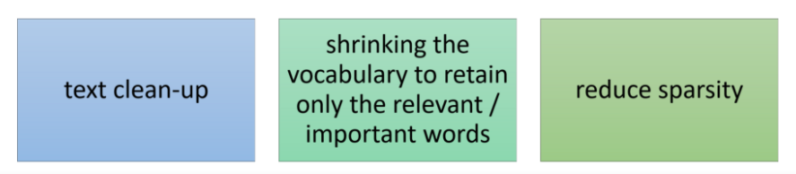
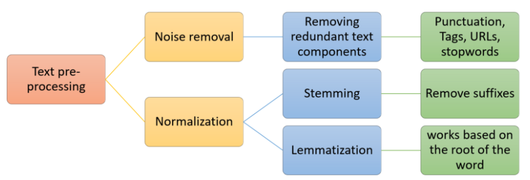
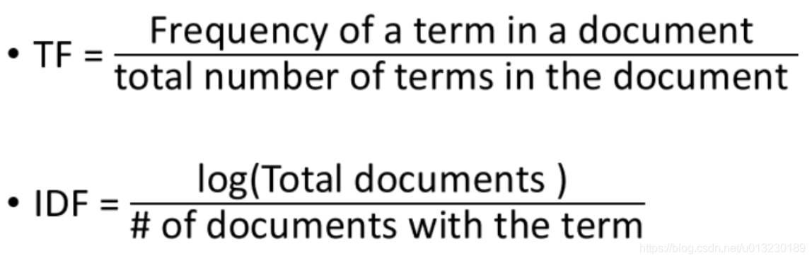

**在许多研究和文章中，其中的一个重要组成部分就是关键字，因为关键字提供了文章内容的简洁表示。关键字在从信息检索系统，数据库中查找文章以及优化搜索引擎中起着至关重要的作用。此外，关键字还有助于将文章分类为相关主题或者学科。关键词**是能够表达文档中心内容的词语，常用于计算机系统标引论文内容特征、信息检索、系统汇集以供读者检阅。关键词提取是文本挖掘领域的一个分支，是文本检索、文档比较、摘要生成、文档分类和聚类等文本挖掘研究的基础性工作。提取关键字的常规方法包括根据文章内容和作者的判断手动分配关键字，但是这需要花费大量的时间和精力，并且在选择适当的关键字方面也可能不准确。随着NLP的发展，关键字提取也变得更加高效、准确。

从算法的角度来看，关键词提取算法主要有两类：**无监督关键词提取**方法和**有监督关键词提取方法**。

**1、无监督关键词提取方法**

不需要人工标注的语料，利用某些方法发现文本中比较重要的词作为关键词，进行关键词提取。该方法是先抽取出候选词，然后对各个候选词进行打分，然后输出topK个分值最高的候选词作为关键词。根据打分的策略不同，有不同的算法，例如TF-IDF，TextRank，LDA等算法。

无监督关键词提取方法主要有三类：**基于统计特征的关键词提取**（TF,TF-IDF）；**基于词图模型的关键词提取**(PageRank,TextRank)；**基于主题模型的关键词提取**(LDA)

- 基于统计特征的关键词提取算法的思想是利用文档中词语的统计信息抽取文档的关键词；
- 基于词图模型的关键词提取首先要构建文档的语言网络图，然后对语言进行网络图分析，在这个图上寻找具有重要作用的词或者短语，这些短语就是文档的关键词；
- 基于主题关键词提取算法主要利用的是主题模型中关于主题分布的性质进行关键词提取；

**2、有监督关键词提取方法**

将关键词抽取过程视为二分类问题，先提取出候选词，然后对于每个候选词划定标签，要么是关键词，要么不是关键词，然后训练关键词抽取分类器。当新来一篇文档时，提取出所有的候选词，然后利用训练好的关键词提取分类器，对各个候选词进行分类，最终将标签为关键词的候选词作为关键词。

**3、无监督方法和有监督方法优的缺点**

无监督方法不需要人工标注训练集合的过程，因此更加快捷，但由于无法有效综合利用多种信息 对候选关键词排序，所以效果无法与有监督方法媲美；而有监督方法可以通过训练学习调节多种信息对于判断关键词的影响程度，因此效果更优，有监督的文本关键词提取算法需要高昂的人工成本，因此现有的文本关键词提取主要采用适用性较强的无监督关键词提取。

**4、关键词提取常用工具包**

- **jieba**
- **[Textrank4zh](https://pypi.org/project/textrank4zh/0.3/) （TextRank算法工具）**
- **[TextBlob](https://pypi.org/project/textblob/) （英文分析）**

这里因为考虑数据量的大小、实验平台的机器的性能和需要标注数据量过大，采用无监督方法中的TD-IDF词频统计方法。

TF-IDF是一种统计量度，用于评估单词与文档集合中的文档的相关性。 这可以通过乘以两个度量来完成：一个单词在文档中出现的次数，以及单词在一组文档中的反向文档出现频率。

它有许多用途，最重要的是在自动文本分析中，并且对于自然语言处理（NLP）的机器学习算法中的单词评分非常有用。

发明了TF-IDF（术语频率与文档频率成反比），用于文档搜索和信息检索。 它的作用是与单词在文档中出现的次数成正比地增加，但与包含该单词的文档的数量相抵消。 因此，即使它们可能出现多次，每个文档中常见的单词（例如，该单词，单词以及单词的排名也很低），因为它们对该文档的意义并不大。

但是，如果“错误”一词在文档中多次出现，而在其他文档中却没有多次出现，则可能意味着它非常相关。 例如，如果我们正在尝试找出某些NPS响应属于哪些主题，那么Bug一词最终可能会与主题可靠性联系在一起，因为大多数包含该词的响应都与该主题有关。

通过将两个不同的指标相乘来计算文档中单词的TF-IDF：

文档中单词的词频。 有多种计算此频率的方法，最简单的方法是单词出现在文档中的原始实例计数。 然后，有一些方法可以根据文档的长度或文档中最常用单词的原始频率来调整频率。

单词在一组文档中的逆文档频率。 这意味着单词在整个文档集中有多普遍或少见。 距离0越近，一个单词越常见。 可以通过以下方法来计算该指标：将文档总数除以包含单词的文档数，然后计算对数。

因此，如果该单词非常普遍并且出现在许多文档中，则该数字将接近0。否则，它将接近1。将这两个数字相乘将得出文档中某个单词的TF-IDF分数。 分数越高，该单词在该特定文档中的相关性就越高。

用更正式的数学术语来说，来自文档集D的文档d中单词t的TF-IDF得分计算如下：

Where:

首先使用数据为经过处理过的数据文件e_paper.csv，该数据文件中一个四列属性，分别是paperID、title、year、abstract。我们指使用其中paperID、title和abstract三列属性。该数据集一共含有数据2092356条数据，但是并不是所有的论文都有收录摘要的所以我们首先要提取摘要为非空的、非等于No abstract available、非等于First Page of the Article和摘要长度大于50的对应的数据一共有1527367条数据。

然后在对数据进行文本的预处理：

在文本处理过程中，由于基于词频建立的巨大的矩阵会存在很多为0值的地方，所以数据形成的矩阵是存在高度的稀疏性的，我们可以通过噪声处理和标准化的方法减少这种数据结果的高度稀疏性。

我们可以将除了核心文本分析其他多余数据当作噪声处理删除。这样我们可以完成文本预处理过程中的噪音处理，而对于标准化处理，通常在文本中表示的是处理同一个单词的不同的表现形式。主要是两种形式，一种是词干streaming，另一种是词性还原Lemmatisation。词干删除后缀来标准化文本单词，而词性还原是一种更高级的技术，它基于单词的词根进行工作。

首先我们需要对我们需要的摘要的数据进行分词和停用词的去除，因为我们需要的是代表这篇文章的摘要中关键的技术，而不是数量最为多的停用词，停用词包括了很多，包括介词、代词、连词等等。我们需要先去除这些停用词，以便我们可以更好的使用文本最常见的词代替上下文相关的单词。这里我们使用我们搜集停用词表进行去除。然后就是对文本的一些常规的处理，包括一些标点符号和小写化等操作，这里可以使用正则的方法去除文本的中的标点符号，然后使用将其变为小写以便我们后期的处理。

然后我们可以使用词云进行展示我们处理后得到词频统计后的结果。

下面是将我们上次得到的已经经过文本数据预处理后的一些词频表对应的单词进行向量化或者是数字化的处理，因为计算机是无法对文本进行模型的运算和计算的，所以我们需要单词也就是字符串进行向量化的处理，语料中的文本转化为机器学习可以输入运行的数据格式，可以分为两个部分，第一个部分是Tokenisation 将文本中转化为单词列表的过程，我们需要通过矢量化来将单词转化为我们需要的数字化的矩阵，第二个部分是Vertorisation，也可以称为文本特征的提取，我们这里选择的模型是简单有效的词袋模型，该模型会忽略文本中的语句的顺序。

### 分别对uni-grams,bi-grams和tri-grams的topN进行可视化

N-Gram是一种基于统计语言模型的算法。它的基本思想是将文本里面的内容按照字节进行大小为N的滑动窗口操作，形成了长度是N的字节片段序列。

每一个字节片段称为gram，对所有gram的出现频度进行统计，并且按照事先设定好的阈值进行过滤，形成关键gram列表，也就是这个文本的向量特征空间，列表中的每一种gram就是一个特征向量维度。

该模型基于这样一种假设，第N个词的出现只与前面N-1个词相关，而与其它任何词都不相关，整句的概率就是各个词出现概率的乘积。这些概率可以通过直接从语料中统计N个词同时出现的次数得到。常用的是二元的Bi-Gram和三元的Tri-Gram。

unigram 一元分词，把句子分成一个一个的字
bigram 二元分词，把句子从头到尾每两个字组成一个词语
trigram 三元分词，把句子从头到尾每三个字组成一个词语.

## 使用TF-IDF提取关键字

然后我们针对每个摘要选取最高得分的前五关键词。例如：

"{'smalltalk': 0.348, 'part': 0.308, 'contact': 0.298, 'preface': 0.255, 'computer': 0.248}"

"{'compaction': 0.599, 'space requirement': 0.157, 'algorithm': 0.155, 'insensitive': 0.153, 'space': 0.147}"

"{'database': 0.434, 'internal': 0.377, 'physical': 0.285, 'reference': 0.239, 'level': 0.209}"