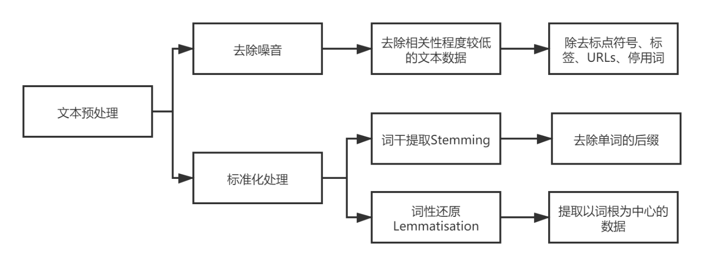
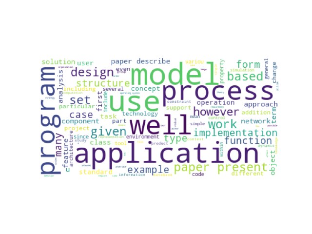
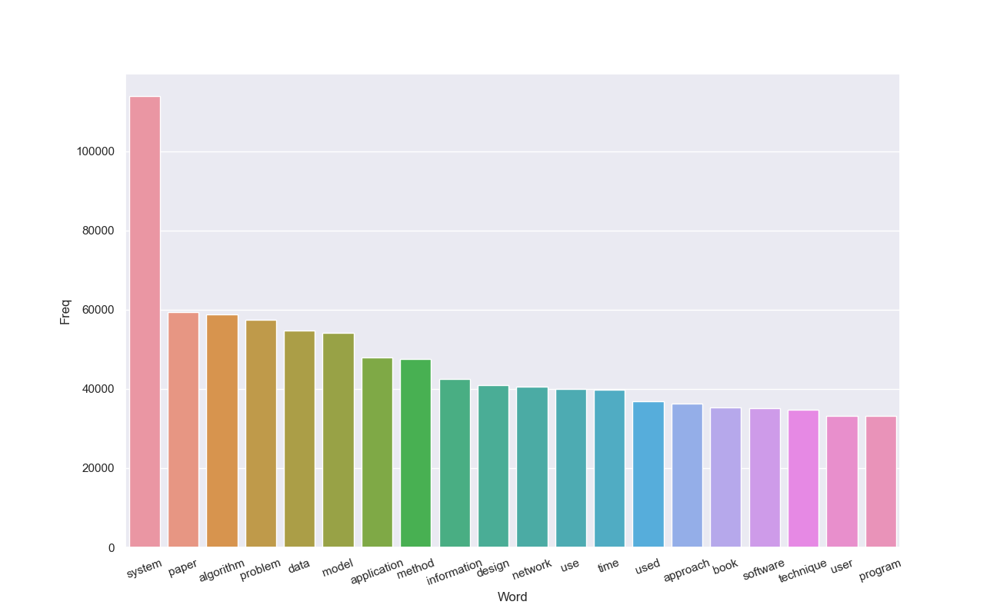
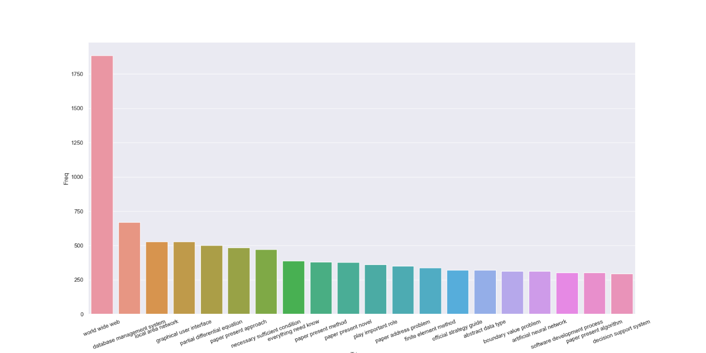
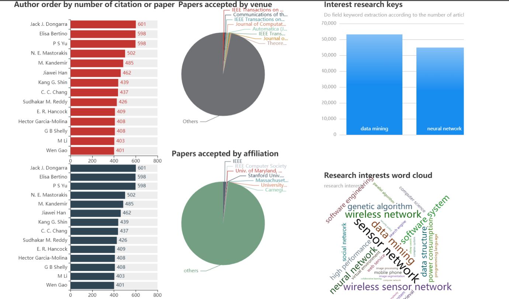

在很多已经发表的研究报告或者发表的文章中，一个重要组成部分就是关键字，关键字可以将文章内容表示为更加简单便于理解的方式。此外，关键词也可以通过无监督学习的聚类进行简单的分类。从算法的角度来看，关键词提取算法主要有两类：无监督关键词提取方法和有监督关键词提取方法。

在本文中，因为考虑数据量的大小、实验平台的机器的性能和需要标注数据量过大，所以采用无监督方法中的TD-IDF词频统计方法。

TF-IDF用于评估单词与文档集合中的文档的相关性。 这可以通过乘以两个度量来完成：文档中单词的词频和单词在一组文档中的逆文档频率。 文档中单词的词频可以通过统计单词出现在文档中的数目来实现。单词的逆文档频率是代表单词在整个文档集中出现频率。通过将文档总数除以包含单词的文档数，然后计算对数计算该指标。将这两个数字相乘将得出文档中某个单词的TF-IDF分数。 分数越高，该单词在该特定文档中的相关性就越高。

本文中使用数据为经过处理过的数据文件e_paper.csv，该数据文件中一个四列属性，分别是paperID、title、year、abstract。我们指使用其中paperID、title和abstract三列属性。该数据集一共含有数据2092356条数据，但是并不是所有的论文都有收录摘要的所以我们首先要提取摘要为非空的、非等于“o abstract available”，非等于“First Page of the Article”和摘要长度大于50的对应的数据一共有1527367条数据。

然后在对数据进行文本的预处理，预处理流程图如下图4.11所示：

                               

###### 图 4.11 文本数据预处理

由于基于词频建立的巨大的矩阵会存在很多为0值的地方，所以数据形成的矩阵是存在高度的稀疏性的，我们可以通过噪声处理和标准化的方法减少这种数据结果的高度稀疏性。我们可以将除了核心文本分析其他多余数据当作噪声处理删除。这样可以完成文本预处理过程中的噪音处理，而对于标准化处理，通常在文本中表示的是处理同一个单词的不同的表现形式。主要是两种形式，一种是词干Streaming，另一种是词性还原Lemmatisation。词干删除后缀来标准化文本单词，而词性还原是一种更高级的技术，它基于单词的词根进行工作。

首先我们需要对我们需要的摘要的数据进行分词和停用词的去除，因为我们需要的是代表这篇文章的摘要中关键的技术，而不是数量最为多的停用词，停用词包括了很多，包括介词、代词、连词等等。我们需要先去除这些停用词，以便我们可以更好的使用文本最常见的词代替上下文相关的单词。这里我们使用我们搜集停用词表进行去除。然后就是对文本的一些常规的处理，包括一些标点符号和小写化等操作，这里可以使用正则的方法去除文本的中的标点符号，然后使用将其变为小写以便我们后期的处理。

然后我们可以使用词云进行展示我们处理后得到词频统计后的结果如图4.12所示：

 

###### 图 4.12 词云

下面是将上次得到的已经经过文本数据预处理后的一些词频表对应的单词进行向量化或者是数字化的处理，因为计算机是无法对文本进行模型的运算和计算的，所以需要单词也就是字符串进行向量化的处理，语料中的文本转化为机器学习可以输入运行的数据格式，可以分为两个部分，第一个部分是Tokenisation 将文本中转化为单词列表的过程，我们需要通过矢量化来将单词转化为我们需要的数字化的矩阵，第二个部分是Vertorisation，也可以称为文本特征的提取，我们这里选择的模型是简单有效的词袋模型，该模型会忽略文本中的语句的顺序。

接着分别对uni-grams、bi-grams和tri-grams的top-N进行可视化。N-Gram是一种基于统计语言模型的算法，是将文本按照字节进行大小为N的滑动窗口操作，形成了长度是N的字节片段序列。每一个字节片段称为gram，对所有gram的出现频度进行统计，并且按照事先设定好的阈值进行过滤，形成这个文本的向量特征空间，列表中的每一种gram就是一个特征向量维度。该模型简单的认为后面出现的词只和它前面出现的词相关，与其它任何位置的词都无关，整句的概率就是各个词出现概率的乘积。uni-grams、bi-grams和tri-grams分别为一元分词、二元分词和三元分词，多少元就代表结果是由几个词组成的。对uni-grams、bi-grams和tri-grams方法分别取排名前20的单词或者词组进行展示，如图4.13、4.14、4.15。 

###### 图 4.13 一元分词可视化

 

###### 图 4.14 二元分词可视化

 

###### 图 4.15 三元分词可视化

使用TF-IDF提取关键字可以得到，针对每个摘要选取最高得分的前五关键词。例如：

  "{'smalltalk': 0.348, 'part': 0.308, 'contact':  0.298, 'preface': 0.255, 'computer': 0.248}"  "{'compaction': 0.599, 'space requirement':  0.157, 'algorithm': 0.155, 'insensitive': 0.153, 'space': 0.147}"  "{'database': 0.434, 'internal': 0.377,  'physical': 0.285, 'reference': 0.239, 'level': 0.209}"  

使用项目中图数据库数据对热门科研人员、研究方向和关键技术进行数据分析，效果如图4.16所示。从左到右依次为，作者按照文章发表的数据和文章被引用的数据降序可视化，文章所属机构和投递的期刊会议所占比例问题，右侧是针对科研领域所发的文章数量降序排列展示，最后是一个词语，用于展示那些科研领域是比较热门（根据的是文章发表的数量）。

 

###### 图4.16 热点方向和技术分析